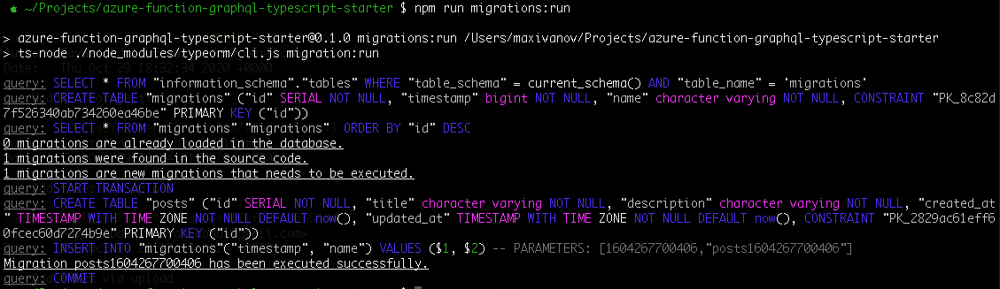
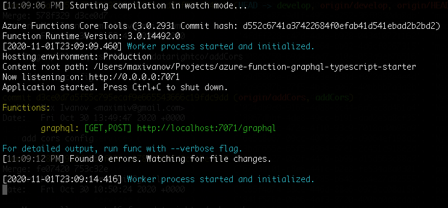
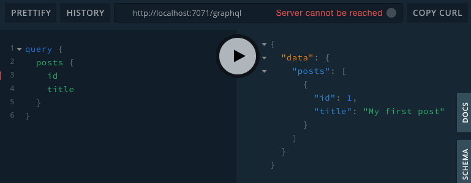

# azure-function-graphql-typescript-starter

Typescript starter for a HTTP-triggered GraphQL Azure Function. Built on top of:

- [Apollo Server](https://www.apollographql.com/docs/apollo-server/deployment/azure-functions/)
  with Azure Functions integration
- [TypeGraphQL](https://typegraphql.com/) to make developing GraphQL APIs simple
  and fun
- [PostgreSQL](https://www.postgresql.org/) as persistence layer
- [TypeORM](https://typeorm.io/#/) for database migrations and useful repository
  classes

Develop and test your API locally and deploy to Azure with confidence.

## Installation

### Prerequisites

- Node.js 12 (it may very well work with earlier versions but I targeted the
  latest version supported by Azure at the moment)
- Docker to start a Postgres server locally
- [Azure Functions Core Tools](https://github.com/Azure/azure-functions-core-tools)
  v3

### Installing

Define database connection details as environment variables in `.env` file
(change the port if you already have another Postgres instance running on
`5432`)

```text
Copy .env.example to .env
```

Start a local Postgres instance

```sh
docker-compose up -d
```

Install npm dependencies

```sh
npm i
```

## Getting Started

### Entities

Create your entities and define GraphqQL- and persistence-specific bits with
Typescript decorators.

[Entities in TypeGraphQL](https://typegraphql.com/docs/types-and-fields.html) |
[Entities in TypeORM](https://typeorm.io/#/entities)

Starter code includes 1 entity to get you started:

`graphql/entities/Post.ts`

```typescript
import {
  Entity,
  Column,
  PrimaryGeneratedColumn,
  UpdateDateColumn,
  CreateDateColumn,
} from 'typeorm'
import { ObjectType, Field } from 'type-graphql'

@ObjectType()
@Entity({ name: 'posts' })
export class Post {
  @Field(() => Int)
  @PrimaryGeneratedColumn()
  id: number

  @Field()
  @Column()
  title: string

  @Field()
  @Column()
  description: string

  @Field()
  @CreateDateColumn({ type: 'timestamptz' })
  createdAt: Date

  @UpdateDateColumn({ type: 'timestamptz' })
  updatedAt: Date
}
```

### Migrations

Whenever you create new or update an existing entity, generate a migration file
with SQL queries needed to take your database structure from its current state
to the new state (defined by entities).
[TypeORM Migrations](https://typeorm.io/#/migrations)

```sh
npm run migrations:generate -- 'your-migration-name'
```

Starter code has 1 migration which creates a table for the `Post` entity:

`graphql/migrations/1604267700406-posts.ts`

```typescript
import { MigrationInterface, QueryRunner } from 'typeorm'

export class posts1604267700406 implements MigrationInterface {
  name = 'posts1604267700406'

  public async up(queryRunner: QueryRunner): Promise<void> {
    await queryRunner.query(
      `CREATE TABLE "posts" (
        "id" SERIAL NOT NULL,
        "title" character varying NOT NULL,
        "description" character varying NOT NULL,
        "created_at" TIMESTAMP WITH TIME ZONE NOT NULL DEFAULT now(),
        "updated_at" TIMESTAMP WITH TIME ZONE NOT NULL DEFAULT now(),
        CONSTRAINT "PK_2829ac61eff60fcec60d7274b9e" PRIMARY KEY ("id")
      )`,
    )
  }

  public async down(queryRunner: QueryRunner): Promise<void> {
    await queryRunner.query(`DROP TABLE "posts"`)
  }
}
```

Review your migration at `graphql/migrations/xxxx-your-migration-name.ts` and
run it:

```sh
npm run migrations:run
```



### Resolvers

Create resolvers supporting the logic of your application. Get some input, do
the processing and database fetches/updates and return some data.
[Resolvers in TypeGraphQL](https://typegraphql.com/docs/resolvers.html)

Starter code has 1 resolver which consists of a `posts()` query and a
`createPost(title, description)` mutation:

`graphql/resolvers/PostResolver.ts`

```typescript
import { Arg, Ctx, Mutation, Query, Resolver } from 'type-graphql'
import { Post } from '../entities/Post'
import { AppContext } from '../util/azure'

@Resolver()
export class PostResolver {
  @Query(() => [Post])
  async posts(@Ctx() { conn }: AppContext): Promise<Post[]> {
    return await conn.getRepository(Post).find()
  }

  @Mutation(() => Post)
  async createPost(
    @Arg('title') title: string,
    @Arg('description') description: string,
    @Ctx() { conn }: AppContext,
  ): Promise<Post> {
    const repo = conn.getRepository(Post)
    const post = repo.create()

    post.title = title
    post.description = description

    await repo.save(post)

    return post
  }
}
```

### GraphQL Server

Start your application:

```sh
npm run start
```

It will start a local Azure Functions emulator (check the console output for
some useful debugging information). It will also watch for changes in your
Typescript files and reload the server as necessary.



Alternatively you can run/debug the function in VS Code, for that you'd need to
install
[Azure Functions for Visual Studio Code](https://github.com/Microsoft/vscode-azurefunctions)

### GraphQL Client

Make some requests to verify the server is working properly.

You can either use a built-in GraphQL Playground
([http://localhost:7071/graphql](http://localhost:7071/graphql))



Or something more old-fashioned like curl:

```sh
  ~ $ curl \
> -X POST \
> -H "Content-Type: application/json" \
> --data '{ "query": "{ posts { id title } }" }' \
> http://localhost:7071/graphql
{"data":{"posts":[{"id":1,"title":"My first post"}]}}
```

### Coding Style & Linter

Make sure code passess all correctness checks and is properly formatted.

Make sure docs are valid Markdown.

```sh
npm run lint
```

### Security Checks

Make sure there are no known vulnerabilities in dependencies.

```sh
npm run audit-security
```

### CI

Linter and security checks will be triggered on new PRs as part of Github CI.

## Deploy to Azure

We're not focusing on the way you set up Postgres in the cloud. You can spin up
a VM and install the database server manually or use a managed instance from any
of the cloud providers.

Couple ways to deploy your code to Azure:

- [Deploying the project to Azure using the Azure CLI](https://www.apollographql.com/docs/apollo-server/deployment/azure-functions/#deploying-the-project-to-azure-using-the-azure-cli)
- [Deploying to Azure from VS Code](https://www.apollographql.com/docs/apollo-server/deployment/azure-functions/#deploying-to-azure-from-vs-code)

Once deployed, set database connection environment variables in Azure Function
App configuration.

- [Manage your function app](https://docs.microsoft.com/en-us/azure/azure-functions/functions-how-to-use-azure-function-app-settings#settings)

## Cleanup

Stop and remove local Postgres Docker container with data volumes:

```sh
docker-compose down --volumes
```

## Credits

- [Fullstack React GraphQL TypeScript Tutorial](https://github.com/benawad/lireddit)
- [Deploying with Azure Functions](https://www.apollographql.com/docs/apollo-server/deployment/azure-functions/)

## License

This project is licensed under the MIT License - see the [LICENSE](LICENSE) file
for details
